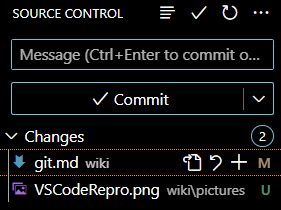

# Git Befehle und Struktur
Die Git Console kann über das Kontextmenue aufgerufen werden. Rechte Maustaste auf ein Ordner und dann Git Bash auswählen.

## git show
Mit diesem Befehl kann festgestellt werden, ob ein Verzeichnis ein Repository ist.

## git init
Mit diesem Befehl wird ein Ordner zu einem Repository gewandelt.

## git status
Mit diesem Befehl kann der Status des Repository ermittelt werden.
Folgende Informationen werden angezeigt:
  * Aktueller Brunch
  * Ob das Repository auf den aktuellen Stand zum Origin ist.
  * Ob unbekannte Dateien im Repository vorhanden sind.
  * Ob Änderungen an Dateien vorliegen.

## git add dateiname
Mit diesen Befehl kann eine Datei dem Repository hinzugefügt werden. Ab diesen Zeitpunkt kennt Git die hinzugefügte Datei.

## git commit -m "commit Message"
Mit diesem Befehl können Änderungen an Dateien ins Repository übernommen werden.

## git log
Mit diesem Befehl können sich die letzten Commits angezeigt werden.

## HEAD
Der HEAD zeigt auf den aktuellen Repository Zustand. Der HEAD kann auf einen älteren Zustand umgebogen werden. Vor diesen Zustand kann anschließend weiter gearbeitet werden. 

## git diff
Mit diesen Befehl können Änderungen an Dateien dargestellt werden.

## .gitignore
Ist eine Datei im Repository die definiert, welche Dateien von Git ignoriert werden soll.

# Nutzung von VS-Code in Verbindung mit einem Repository
Mit Visual Studio Code kann ein Ordner geöffnet werden, der ein Repository abbildet. VS-Code erkennt den Ordner als Repository.

Werden Änderungen an Dateien vorgenommen oder neue Dateien in VS-Code hinzugefügt, dann wird dass an der linken Seite mit dem folgenden Symbol (Source Control) angezeigt:

Die Zahl zeigt an, dass eine Änderung vorliegt.

## commit mit VS-Code
Im Reiter Source Control können Commits über die GUI getätigt werden. Hierzu wird die folgende Maske bereitgestellt: 

Über das Plus-Zeichen kann entschieden werden, welche geänderten Dateien mit dem Commit übernommen werden sollen.

In Message kann eine Commitmessage eingegeben werden.

Mit der Schaltfläche Commit wird der Commit ausgeführt.

# Literaturempfehlung

* Pro Git by Scott Chacon an Ben Straub
* Git in Practice by Mike McQuaid